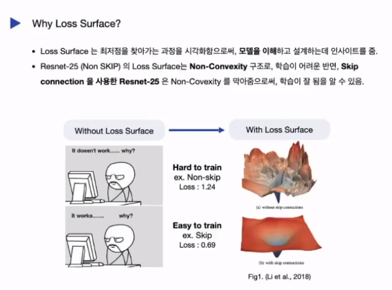
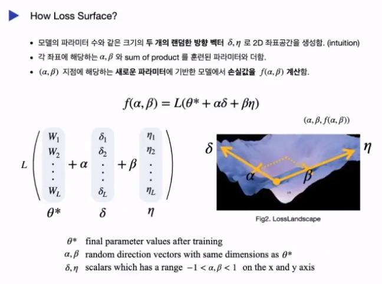
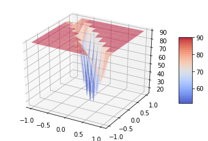
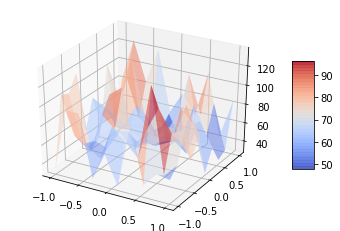
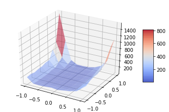

## 1. Loss Surface 란?

신경망을 훈련시킨다는 것은 고차원의 손실 함수에서 파라미터를 업데이트해가며 <b>전역 최저점을 찾아가는 과정</b>입니다.

신경망의 훈련은 신경망의 구조, 최적화 방법, 그리고, 가중치 초기화 등 다양한 변수의 영향을 받습니다.
즉, 네트워크를 어떻게 설정하느냐에 따라 신경망의 훈련은 <b>쉬울수도, 어려울 수도</b> 있습니다. 

</img>

신경망의 목적함수는 고차원 함수이기때문에, 네트워크가 어떻게 학습이 되고 있는지 직관적으로 알기 어렵습니다.
하지만, 고차원의 목적 함수를 사람이 이해할 수 있는 3차원 공간안에 표현함으로써, 신경망의 훈련 과정을 더 잘 이해할 수 있으며, 네트워크 설계에 필요한 인사이트를 얻을 수 있습니다.  

### Loss Surface 만드는 법  
Loss Surface를 시각화하는 방법은 두개의 가우시안 분포를 따르는 랜덤 방향 벡터를 만드는 것입니다. (0,0) 의 중앙 지점은 이미 훈련된 파라미터에서의 Loss 값으로 최저점을 의미한다고 볼 수 있습니다. 
두개의 방향 벡터를 만든 뒤, 각 방향벡터에 -1 부터 1까지의 상수를 곱하고, 기존 네트워크의 학습된 파라미터와 더하여 Loss Surface 를 시각화 합니다.  

</img>

위 방법을 사용함으로써, 고차원의 Loss Surface를 3차원 좌표에 표현을 할 수 있습니다. 
Loss Surface에 관한 자세한 설명 및 논문 리뷰는 <a target="_blank" href="https://youtu.be/sAslF_B-JBE">링크</a>를 참조바랍니다. 

## 2. Loss Surface 가 강화학습을 만날 때,
Loss Surface는 고차원의 변수를 학습하는 어느 딥러닝 모델에서도 사용가능합니다. 아래 그림은 MNIST 데이터를 2개의 은닉층을 가진 신경망에 학습한 Loss Surface 그림 입니다.

</img>

이번 프로젝트에서는 MNIST를 데이터를 가지고, 기본적으로 Loss Surface 를 표현하는 예제와 Loss Surface 를 강화학습 모델에 적용한 예제를 살펴보도록 하겠습니다. 강화학습 예제에서는 오픈에아이 짐이라는 환경을 통해서 카트폴에 Q-Network 와 DQN 알고리즘을 적용해보겠습니다. 같은 환경에서 두개의 다른 알고리즘을 적용하면서 Q-Network 와 DQN 알고리즘의 Loss Surface를 비교해보도록 하겠습니다.
<ol>
  <li>1_MNIST_LossSurface.ipynb </li> 
  <li>2_QNetwork_LossSurface.ipynb </li> 
  <li>3_DQN_LossSurface.ipynb</li> 
</ol>

### 1. Q-Network Loss Surface 

Q-Network 에서는 신경망이 전역 최저점으로 수렴하지 못하는 문제가 있었습니다. 그 원인은, 
1. 샘플들간의 시간적인 상관관계가 있기 때문입니다. 
만약에 안좋은 방향으로 학습이 진행된다면 신경망은 그 방향으로 계속 업데이트가 되게 되므로, 이 경우 정작 좋은 상황에 대해 학습을 못하기 때문에 학습이 잘 되지 않습니다. 
2. 업데이트의 목표가 되는 정답이 계속 변하기 때문에 최적화하기 어렵습니다.

</img>

### 2. DQN Loss Surface 
DQN 알고리즘은 2013년 딥마인드가 "playing atari with deep reinforcement leanring" 이라는 논문에서 소개했습니다.

1. Experience Replay 
에이전트가 환경을 탐험하며 얻은 샘플을 메모리에 저장합니다 이 리플레이 메모리에서 여러개의 샘플을 무작위로 뽑아서 뽑은 샘플에 대해 신경망을 학습합니다. 리플레이 메모리를 사용함으로써, Q network 가 가지고 이던 샘플 간의 상관관계를 없앨 수 있습니다. 

2. Target Network
타깃신경망을 따로 만들어서 일정 시간동안 값을 유지하도록 합니다.

</img>

